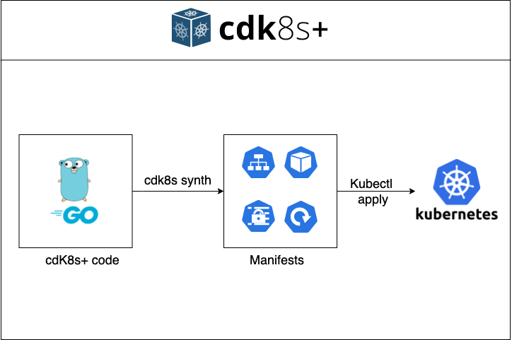
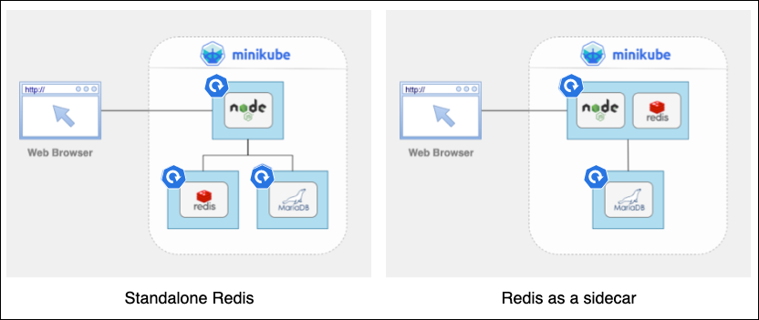

# No Yaml, no problem
## Deploying applications to K8s with AWS cdk8s+ example (in Go!)

This repo shows how to generate Kubernetes manifests for a sample web application using AWS cdk8s+



Note that this repo is written in Go, but the same code could have been written in Python, Typescript or Javascript

### The application


The app has three components, which run in 3 separate containers:

- **MariaDB database**: Based on the official MariaDB image and used to store application data. When the image is initialized, a test database and a test table are automatically created. Sample data is loaded to the container initialization via the script in the ./MariaDB/init directory.
- **Redis**: Based on the official Redis image and used to cache data to be displayed in the application.
- **Nodejs**: app packaged via the ```Dockerfile``` in the nodeApp directory. The app has three entry points:
    - **root** ("/")  displays the name of the host where the page is hosted
    - **/mariadb** displays a list of foods pulled straight from MariaDB
    - **/redis** gets the same list of foods but uses Redis to cache the data. Additionally, it contains a Refresh button that helps
      display whether that data comes from Redis or MariaDB

Additionally, the code takes advantage of the cdk8s integration with Helm to deploy Prometheus.

### Repo organization

The repo is organized using the following folders:

- **cdk8sgen**: Go code to generate our application YAML manifests
- **doc/images**: Images used in the Readme.md file
- **MariaDB**: initialization script and environment variables for Maria DB
- **nodeApp**: Code for our node application
- **redis**: Environment variables for Redis

### Requirements

- **cdk8s+** generates the K8s Manifest
- **Docker** build and runs the application image locally and pushes it to DockerHub
- **DockerHub account**  to push the application image
- **Kubernetes environment** that will host our application (e.g.: Minikube, EKS, etc....)

### Building the application image

While the application uses the official MariaDB and Redis images from Docker Hub, the nodejs application container
must be built locally and pushed to an image registry

Before building and pushing the nodejs application image to the registry, we can test the application locally:

```shell
    make start
```

That will build the image locally and start it up (along with Redis and MariaDB) using docker compose. 
Once the command completes, the application can be reached at `localhost:3000`

To bring the application down:

```shell
    make stop
```

To build the nodejs application image and push it to DockerHub:

```shell
    make pushtohub account=<registryAccount>  
```

Where `<registryAccount>` is the DockerHub account to be used when pushing the image as part of the `docker push `command 

### Generating the manifests

The repo uses the Go version of cdk8s+ code to generate the application's Kubernetes manifests.

Note that the application's cdk8s+ code has been designed to deploy Redis either as an independent deployment or as
a sidecar in the node application deployment. This can be controlled using the `redisSidecar` constant which is
located in the main.py/main.go files. 



Before generating the manifest, update the `NodeappImage` variable in the `cdk8sgen/nodeapp.go` file so that it points
to the same nodejs application image that we pushed in the previous section (e.g.:`<registryAccount>/cdk8sdemo`) 

To generate the manifests (starting from the repo root folder):

```shell
cd cdk8sgen
cdk8s synth
```

The files will be generated in the cdk8sgen/dist folder


### Deploying the application to K8s

- Make sure a Kubernetes environment is available
- From the application root folder:

```shell
      Kubectl apply --recursive -f cdk8sgen/dist
```
